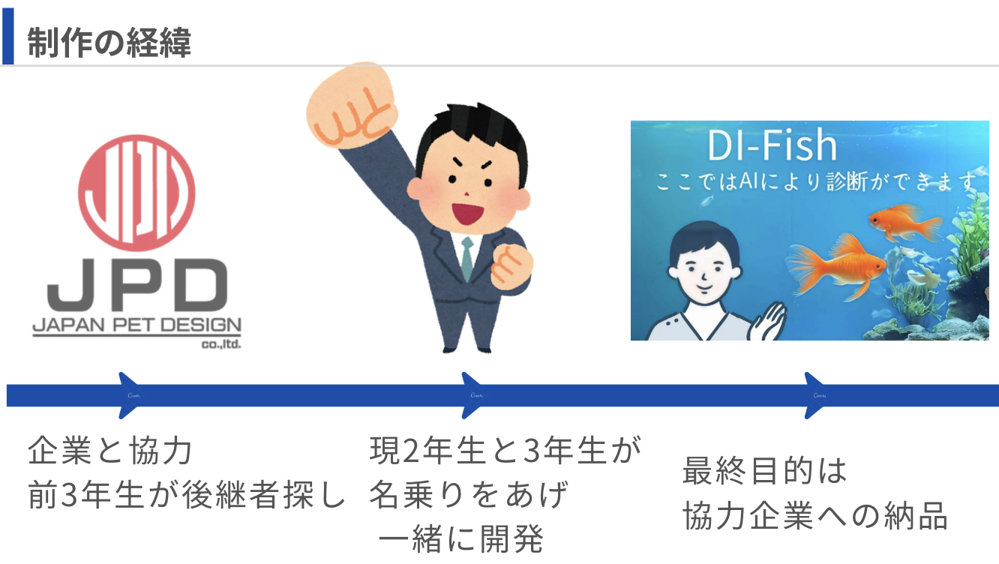

# 企画概要

## **目次**

- [00. プロジェクト名](#00-プロジェクト名)
- [01. 概要](#01-概要)
- [02. 背景(DI-FISHの歴史)と目的](#02-背景di-fishの歴史と目的)
- [03. 想定ユーザー・利用シーン](#03-想定ユーザー利用シーン)
- [04. 提供機能一覧](#04-提供機能一覧)
- [05. 使用技術・構成図](#05-使用技術構成図)
- [06. 導入・運用方針](#06-導入運用方針)
- [07. 今後の展望](#07-今後の展望)

### **00. プロジェクト名**

**DI-FISH**  
*Disease Identification - FISH（魚病気判別）* の略称

## **01. 概要**
本プロジェクトは、鑑賞魚に発生する病気を画像から自動判別するAIを利用したWebアプリケーションの「DI-FISH」に関する仕様書です。  

本仕様書は、開発における要件、運用保守、また軽くプロジェクトの歴史や用語などについて記載しております。

## **02. 背景(DI-FISHの歴史)と目的**

### **目的**

本プロジェクトの目的は、鑑賞魚に発生する病気を早期に発見し、適切な対処法を提示できる仕組みを一般家庭でも実現可能にすることです。

背景として、観賞魚の病気に飼い主が気づけず突然死（へい死）に至る事例が多く、精神的・経済的損失が発生しています。  
また、全国で観賞魚を診察可能な動物病院は 71 件と少なく、犬（8,958 件）や鳥類（2,660 件）と比べて著しく不足しているのが現状です  
（参考：ペットライフ <https://petlife.asia/hospital/search/birds/>）。

この課題を解決するため、AIによる画像診断を用いて、病気の早期判別と適切な処置・投薬の提案を行うWebアプリケーション「DI-FISH」を開発します。

### **DI-FISHの歴史**

まず簡単に DI-FISH がどのような経緯でできたか説明します。

以下の図のような流れがありました。

#### 少し詳しく

- 25卒世代（基本的には）の先輩方が「制作演習」の授業にて、別の案件でデータ収集を行っていた際に日本動物薬品株式会社さんと意気投合。
- そこで魚病判別システムの構想が生まれ、先輩方は構想を残して卒業。
- 翌年度、それを引き継いだのが昨年 DW に出場したチーム。
- より正確に表現するなら**「精神的後継プロジェクト」**という位置付けになる。

## **03. 想定ユーザー・利用シーン**

### **想定ユーザー**
以下のようなユーザー層を想定しています。
- 日本動物薬品株式会社さんのHPを利用するユーザー(<a href="https://www.jpd-nd.com/shinryo/about/">日本動物薬品株式会社さんの魚の診療所ページ</a>)
- 自宅で飼っている魚の体表に異常を発見し、スマートフォンで写真を撮影して診断
<!--分析次第に追加-->

### **利用シーン**
- 自宅で飼っている魚の異常を発見し、スマートフォンなどで撮影してその画像をアップロードして診断
-日本動物薬品株式会社さんのHPを利用時に異常を感じて、写真診断を実施。

## **04. 提供機能一覧**
#### ①Topページ

## **05. 使用技術・構成図**

## **06. 導入・運用方針**

## **07. 今後の展望要**
